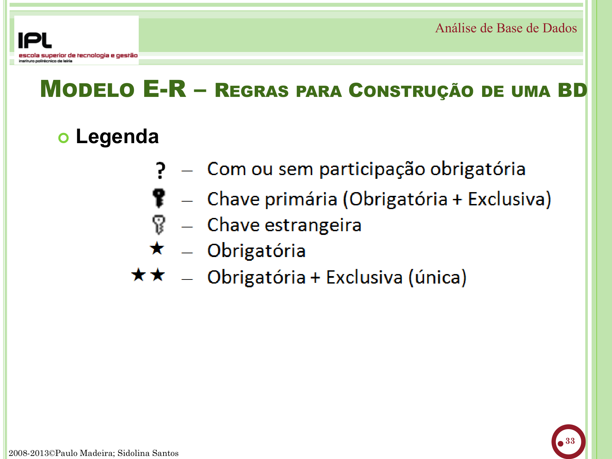
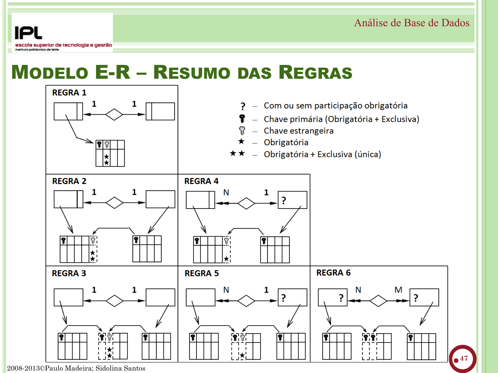
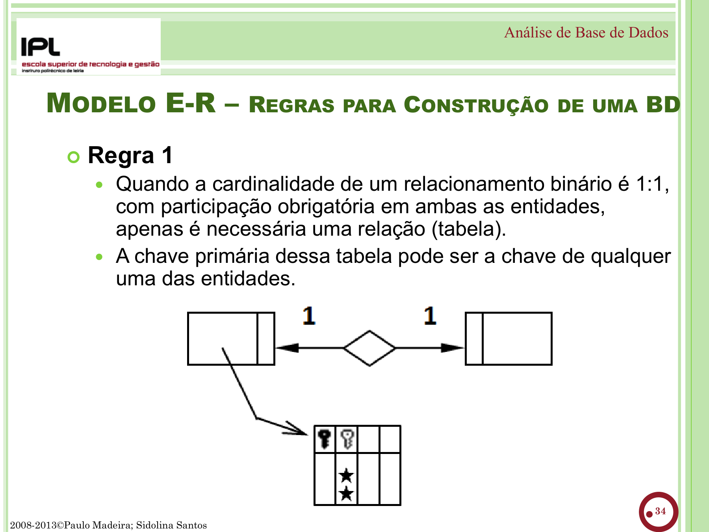
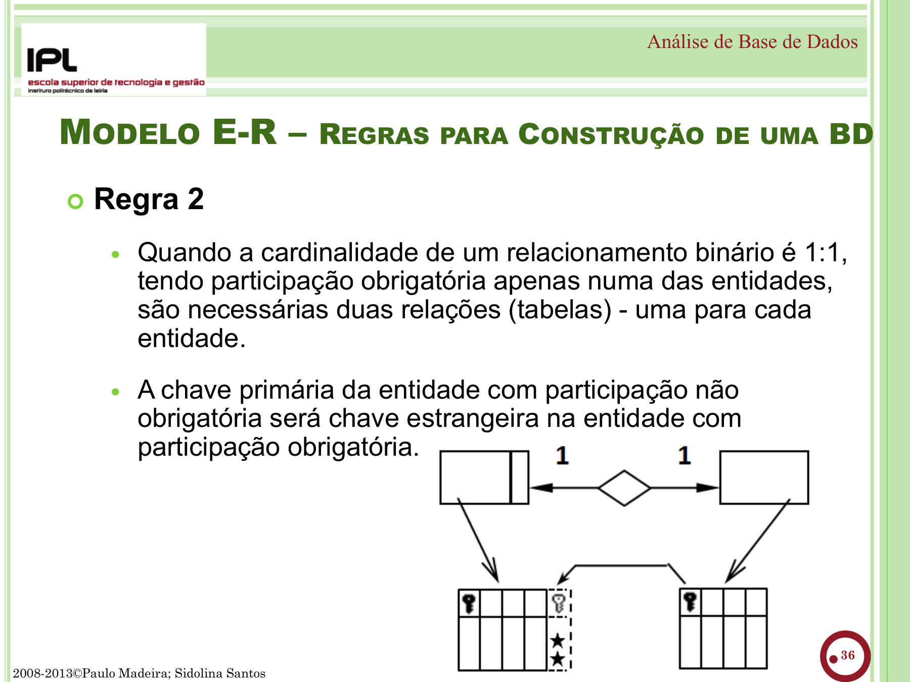
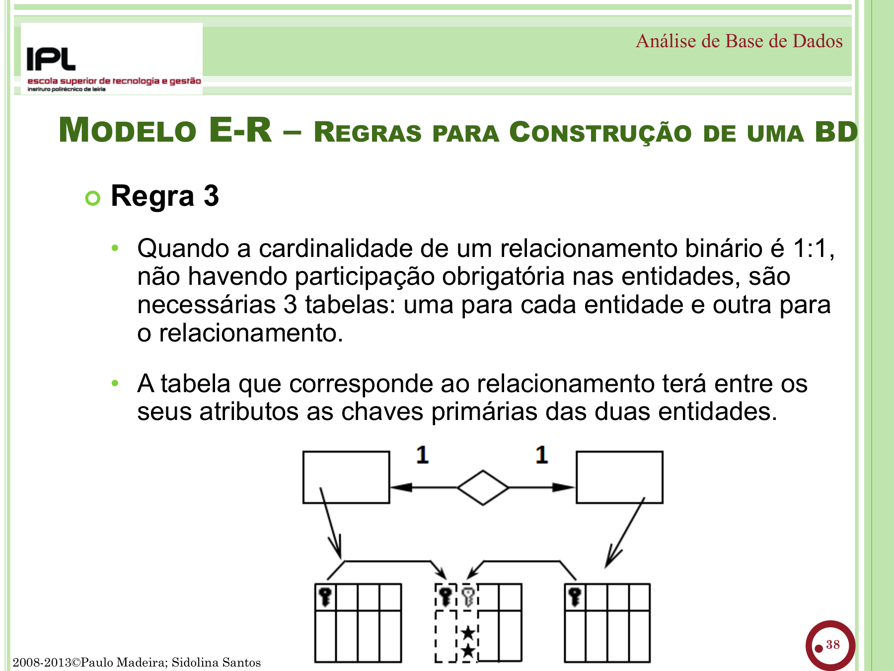
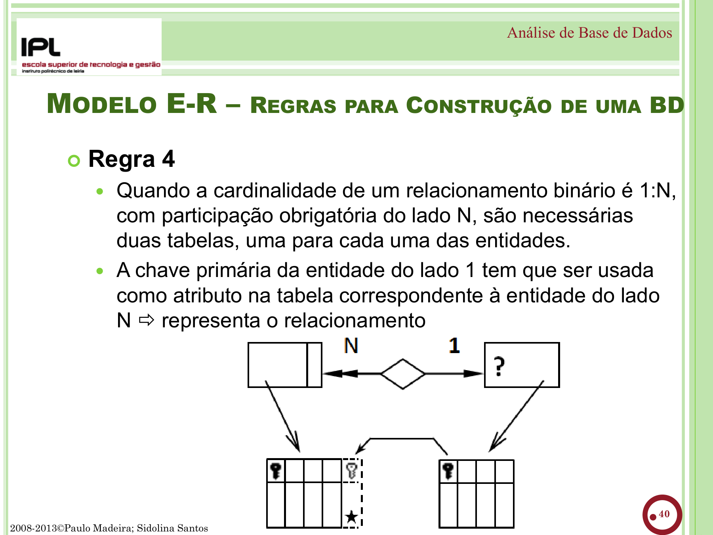
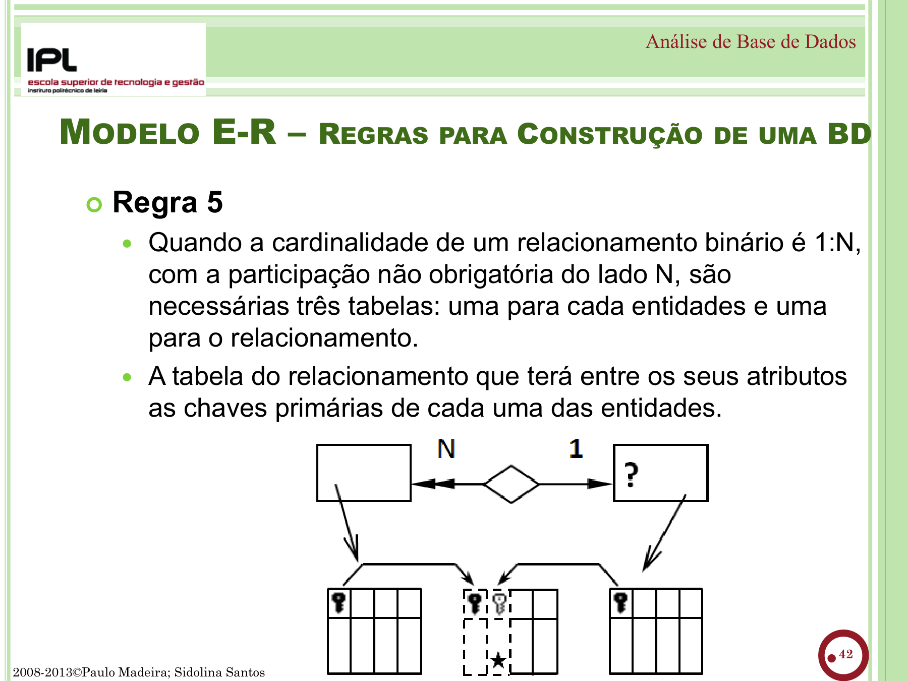
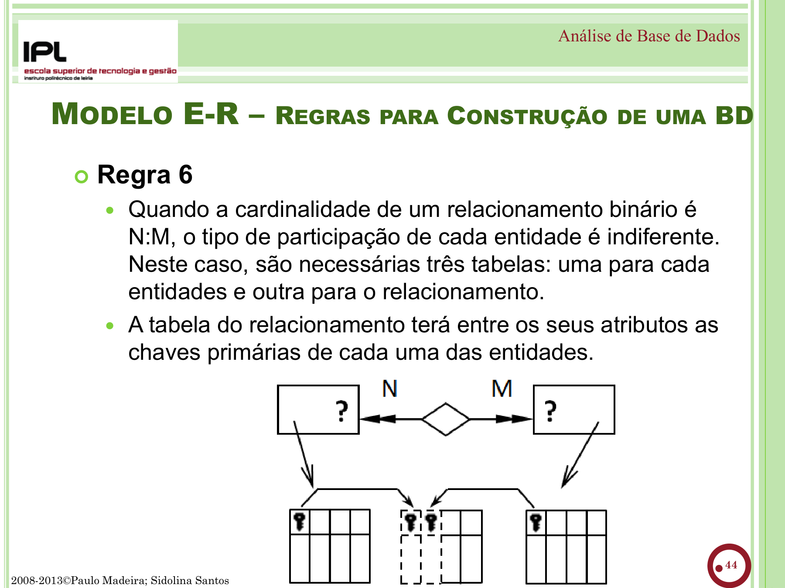

# Modelo Entidade-Relacionamento — Dados na Administração Pública

Este módulo introduz o **Modelo Entidade-Relacionamento (E-R)** como ferramenta de concepção de bases de dados em contexto de administração pública. As três aulas utilizam o cenário da **Câmara Municipal de Vila Feliz** — gestão de eventos culturais — onde é necessário organizar dados de munícipes, espaços, artistas e logística.

!!! info "Pré-requisitos"
    - Módulo BPMN concluído
    - Navegador web actualizado (Chrome, Firefox ou Edge)
    - Acesso à internet para usar o [ERDPlus](https://erdplus.com)
    - Não é necessário instalar software
    - Recomendado: segundo ecrã para ter o diagrama e o enunciado lado a lado

!!! tip "Recursos de consulta rápida"
    - :material-file-document-outline: [**Ficha de Consulta Rápida**](cheat-sheet.md) — página A4 imprimível com notação, legenda dos símbolos, 6 regras e 9 fases
    - :material-alert-outline: [**Erros Frequentes**](erros-frequentes.md) — catálogo de anti-padrões com exemplos e correcções

---

## Porquê Modelação de Dados na AP?

Os serviços públicos dependem de **dados** — registos de cidadãos, licenciamentos, recursos humanos, orçamentos, inventários, actas. Quando esses dados vivem em folhas de cálculo, emails e papel:

- **Redundância** — o mesmo munícipe aparece repetido em dez ficheiros diferentes
- **Inconsistência** — a morada está actualizada num sítio e desactualizada noutro
- **Impossibilidade de cruzamento** — não se consegue saber quantos eventos um artista participou
- **Risco de incumprimento do RGPD** — dados pessoais dispersos, sem controlo de acesso

O **Modelo E-R** fornece uma forma visual de projectar a estrutura dos dados **antes** de construir qualquer sistema. É o equivalente à planta de um edifício — projecta-se primeiro, constrói-se depois.

!!! tip "Analogia"
    Assim como o BPMN mapeia **processos** (quem faz o quê e quando), o Modelo E-R mapeia **dados** (que informação guardamos e como se relaciona). São ferramentas complementares na modernização de serviços públicos.

---

## Estrutura do módulo

| Etapa | Pergunta-chave | O que se faz |
|-------|---------------|--------------|
| **Do Excel ao Modelo Conceptual** | "O que temos? O que está mal?" | Partir de um Excel caótico → identificar entidades, atributos e relações |
| **Das Relações às Tabelas** | "Como organizar?" | Definir pressupostos → aplicar regras → obter tabelas |
| **Da Concepção à Especificação** | "Como finalizar?" | Normalizar, escolher chaves, definir domínios → especificação final |

---

## Conceitos rápidos

| Conceito | Símbolo | O que é | Exemplo |
|----------|---------|---------|---------|
| **Entidade** | :material-rectangle-outline: Rectângulo | Objecto sobre o qual guardamos dados | Evento, Espaço, Artista |
| **Atributo** | :material-ellipse-outline: Elipse | Propriedade de uma entidade | nome, data, lotação |
| **Chave primária (PK)** | :material-key: Chave | Identifica univocamente cada registo | codEvento, NIF |
| **Chave candidata** | — | Atributo que poderia ser PK | NIF, nº contribuinte |
| **Chave estrangeira (FK)** | :material-key-link: | Referencia a PK de outra entidade | codEspaco na entidade Evento |
| **Relação** | :material-rhombus-outline: Losango | Associação entre entidades | "realiza_em", "participa" |
| **Cardinalidade** | 1, N, M | Quantos de cada lado participam | 1:N, M:N |

---

## Cardinalidade — resumo

| Tipo | Significado | Exemplo AP |
|------|------------|------------|
| **1:1** | Cada A tem exactamente um B | Presidente ↔ Câmara |
| **1:N** | Cada A tem vários B, cada B pertence a um A | Departamento → Funcionários |
| **M:N** | Vários A associados a vários B | Evento ↔ Artistas |

## Participação

| Tipo | Notação no diagrama | Significado |
|------|-------------------|-------------|
| **Obrigatória (total)** | Linha dupla | Todos os registos **devem** participar |
| **Não obrigatória (parcial)** | Linha simples | Nem todos participam |

!!! note "Notação usada neste curso"
    Adoptamos a **notação Chen** (Peter Chen, 1976) — a notação clássica do Modelo E-R, suportada pelo [ERDPlus](https://erdplus.com) e usada na sebenta teórica. Caracteriza-se por:

    - **Rectângulos** para entidades, **losangos** para relações, **elipses** para atributos
    - **Linha dupla** = participação obrigatória; **linha simples** = participação parcial
    - **Atributo-chave** sublinhado; **multivalor** em elipse dupla; **derivado** a tracejado

    Existem outras notações (Crow's Foot, UML, IDEF1X) usadas na indústria, mas a notação Chen é a mais clara para aprender o modelo conceptual — separa visualmente entidade, atributo e relação. Quando convertermos para o **esquema relacional** (tabelas), passamos à notação `TABELA(pk, atributo, fk)`, que o ERDPlus gera automaticamente.

---

## Conversão E-R → Tabelas — as 6 Regras de Construção

### Porquê aplicar regras de conversão?

O diagrama E-R é um **modelo conceptual** — desenha entidades, atributos e relações de forma visual. Mas uma base de dados real não guarda losangos nem elipses: guarda **tabelas** com linhas e colunas. As **regras de conversão** são o procedimento padronizado que traduz o diagrama em tabelas, garantindo que:

- **Não se perde informação** — todos os atributos e ligações do diagrama ficam representados
- **Não se gera redundância** — cada dado é guardado num único sítio
- **Não aparecem campos vazios desnecessários** — evita-se o desperdício e os erros associados a NULLs
- **Cada tabela tem uma chave que identifica univocamente as suas linhas** — base para consultas correctas

Sem regras, dois analistas a converter o mesmo diagrama produziriam tabelas diferentes. As regras existem para que **qualquer pessoa**, partindo do mesmo diagrama, chegue às **mesmas tabelas**.

### Legenda dos símbolos

Para ler os diagramas das regras, use esta legenda:

{ loading=lazy }

| Símbolo | Significado |
|---------|-------------|
| **?** | Com ou sem participação obrigatória (indiferente) |
| :material-key: | **Chave primária** (obrigatória + exclusiva) |
| :material-key-outline: | **Chave estrangeira** |
| **★** | Obrigatória |
| **★★** | Obrigatória + Exclusiva (única) |

### Resumo visual das 6 regras

{ loading=lazy }

### As 6 regras de construção

| Regra | Cardinalidade | Participação | Nº tabelas | Onde fica a FK |
|-------|--------------|-------------|------------|----------------|
| **1** | 1:1 | Obrigatória **em ambas** | **1** | PK de qualquer das entidades |
| **2** | 1:1 | Obrigatória **apenas numa** | **2** | PK da não-obrigatória → FK na obrigatória |
| **3** | 1:1 | **Nenhuma** obrigatória | **3** | Tabela da relação com ambas as PKs |
| **4** | 1:N | Obrigatória **do lado N** | **2** | PK do lado 1 → FK no lado N |
| **5** | 1:N | **Não** obrigatória do lado N | **3** | Tabela da relação com ambas as PKs |
| **6** | N:M | Indiferente | **3** | Tabela da relação com ambas as PKs |

!!! tip "Regras mais comuns na AP"
    Na prática, **95% dos casos** caem em duas situações: **Regra 4** (relação 1:N com obrigatoriedade no lado N → 2 tabelas) e **Regra 6** (relação N:M → 3 tabelas). Dominar estas duas cobre quase todos os cenários reais.

---

### Regra 1 — 1:1 com participação obrigatória em ambas

{ loading=lazy }

Quando a cardinalidade é **1:1** e a participação é **obrigatória em ambas** as entidades, basta **1 tabela** — a chave primária pode ser a chave de qualquer uma das entidades.

**Exemplo Vila Feliz**: *Cada Edição de Festival tem um Cartaz Oficial e cada Cartaz Oficial refere-se a uma única Edição — ambas obrigatórias.*

→ Basta a tabela `EDICAO_FESTIVAL(codEdicao, ano, tema, cartazURL, ...)`.

---

### Regra 2 — 1:1 com participação obrigatória apenas numa

{ loading=lazy }

Quando a cardinalidade é **1:1** e a participação é **obrigatória apenas numa** das entidades, são necessárias **2 tabelas** — uma por entidade. A PK da entidade com participação não obrigatória entra como FK na entidade com participação obrigatória.

**Exemplo Vila Feliz**: *Cada Evento tem obrigatoriamente um Coordenador, mas nem todo Funcionário é coordenador de um evento.*

→ `EVENTO(codEvento, ..., #codFuncionario)` + `FUNCIONARIO(codFuncionario, ...)`.

---

### Regra 3 — 1:1 sem participação obrigatória

{ loading=lazy }

Quando a cardinalidade é **1:1** e **nenhuma** das entidades tem participação obrigatória, são necessárias **3 tabelas** — uma para cada entidade e uma para o relacionamento. A tabela do relacionamento contém as chaves primárias das duas entidades.

**Exemplo Vila Feliz**: *Um Artista pode ser apadrinhado por uma Escola Local (opcional) e cada Escola pode apadrinhar um Artista (opcional).*

→ `ARTISTA(...)` + `ESCOLA(...)` + `APADRINHAMENTO(#codArtista, #codEscola, dataInicio)`.

---

### Regra 4 — 1:N com participação obrigatória no lado N

{ loading=lazy }

Quando a cardinalidade é **1:N** e há **participação obrigatória do lado N**, são necessárias **2 tabelas**. A chave primária da entidade do lado 1 entra como FK na tabela do lado N.

**Exemplo Vila Feliz**: *Cada Evento realiza-se num único Espaço (obrigatório). Um Espaço acolhe vários Eventos.*

→ `EVENTO(codEvento, nome, ..., #codEspaco)` + `ESPACO(codEspaco, nome, ...)`.

---

### Regra 5 — 1:N sem participação obrigatória no lado N

{ loading=lazy }

Quando a cardinalidade é **1:N** e o lado N **não** tem participação obrigatória, são necessárias **3 tabelas** — uma para cada entidade e uma para o relacionamento, contendo as PKs das duas entidades.

**Exemplo Vila Feliz**: *Um Artista pode (ou não) ter um Agente associado ao seu contrato.*

→ `ARTISTA(...)` + `AGENTE(...)` + `REPRESENTACAO(#codArtista, #codAgente, dataInicio)`.

---

### Regra 6 — N:M com participação indiferente

{ loading=lazy }

Quando a cardinalidade é **N:M**, a participação é **indiferente** (obrigatória ou não em qualquer lado). São sempre necessárias **3 tabelas** — uma para cada entidade e uma para o relacionamento, contendo as PKs das duas entidades.

**Exemplo Vila Feliz**: *Um Evento tem vários Patrocinadores. Um Patrocinador apoia vários Eventos.*

→ `EVENTO(...)` + `PATROCINADOR(...)` + `PATROCINIO(#codEvento, #codPatrocinador, valor)`.

---

!!! tip "Treino específico — identificar a regra"
    Disponível um [**worksheet com 10 cenários curtos para praticar a identificação da regra correcta**](worksheets/worksheet-fase5-treino.docx) — dados a cardinalidade e a participação, qual é a regra a aplicar?

---

## Nomenclatura

Para documentar o esquema relacional, usa-se a convenção:

```
ENTIDADE(atributo1, atributo2, atributo3, ...)
```

- **Sublinhado** → chave primária (PK)
- *Itálico* → chave estrangeira (FK)

**Exemplo:**

```
EVENTO(codEvento, designação, dataInício, dataFim, codEspaco)
       ─────────                                   ─────────
           PK                                          FK

ACTUAÇÃO(codEvento, codArtista, cachê)
         ─────────  ──────────
          FK (PK)    FK (PK)     ← PK composta
```

---

## Fases de Criação de uma Base de Dados

| Fase | Descrição | Resultado |
|------|-----------|-----------|
| 1 | **Determinar entidades** | Lista de entidades relevantes |
| 2 | **Desenhar DER simplificado** | Diagrama só com entidades e relações |
| 3 | **Definir pressupostos** | Regras de negócio documentadas |
| 4 | **Desenhar DER completo** | Diagrama com atributos, PKs, cardinalidades |
| 5 | **Determinar tabelas** (aplicar regras) | Esquema relacional preliminar |
| 6 | **Determinar chaves candidatas** | Lista de possíveis identificadores |
| 7 | **Determinar chaves primárias** | PK escolhida para cada tabela |
| 8 | **Definir tabelas finais** | Nomenclatura completa com PKs e FKs |
| 9 | **Definir domínio dos atributos** | Tipo de dados e restrições |

!!! warning "Não saltar fases"
    Sem o diagrama E-R e os pressupostos documentados, a base de dados resultante terá problemas estruturais difíceis de corrigir posteriormente.

---

!!! note "E-R não é a base de dados"
    Tal como o BPMN não é um fluxograma, o Modelo E-R **não é** uma base de dados — é um **modelo conceptual**. A implementação (criação de tabelas, inserção de dados, consultas) é feita num SGBD como Access, MySQL ou PostgreSQL. O diagrama E-R é o projecto; o SGBD é a obra.
